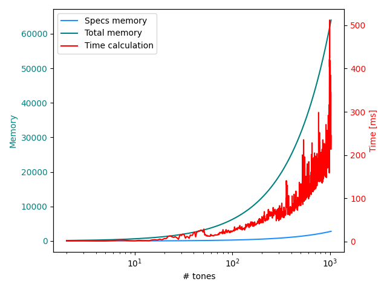
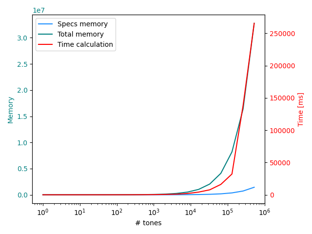
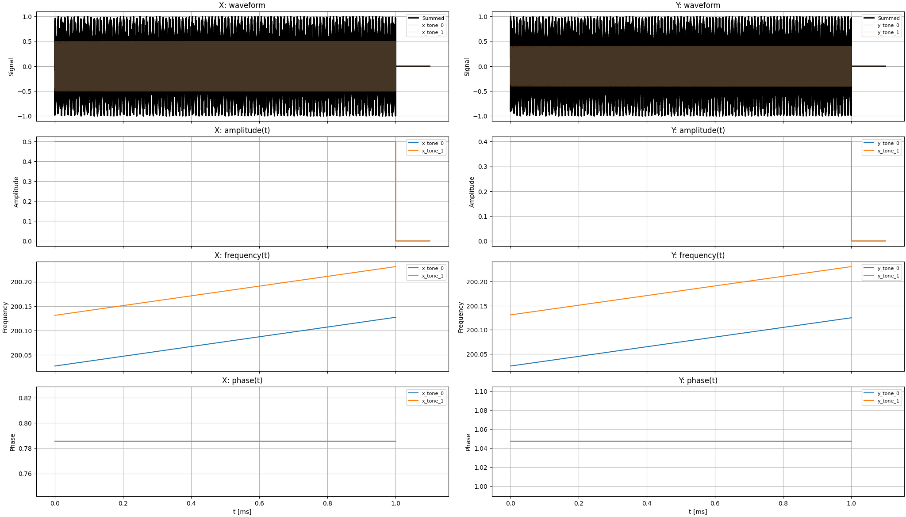
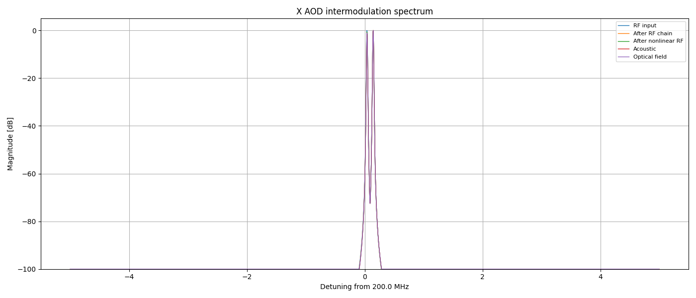
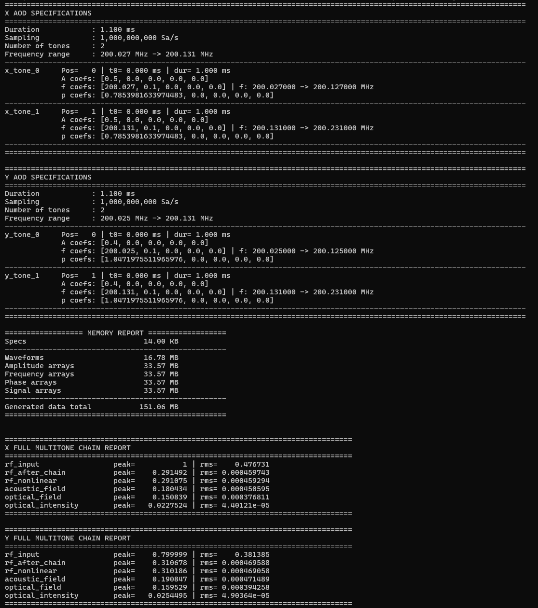

# Waveform generator simulator for multi-tone atom transport

Simulator of the waveform generator for atom multi-tone transport with RF signals driving 2D AODs. Based on specifications of the tones:

```python
 x_specs = {
                "axis": "X",
                "duration": simulation_duration,
                "sampling": sampling,
                "response": response,
                "tones": [
                    {"name": "x_tone_0", "space_coord": 0, "t0": 0.0, "tone_duration": pulse_duration, "amplitude": [0.5, 0.0, 0.0, 0.0, 0.0], "frequency": [200.027, sweep_span / pulse_duration, 0.0, 0.0, 0.0], "phase": [np.pi / 4, 0.0, 0.0, 0.0, 0.0]},
                    {"name": "x_tone_1", "space_coord": 1, "t0": 0.0, "tone_duration": pulse_duration, "amplitude": [0.5, 0.0, 0.0, 0.0, 0.0], "frequency": [200.131, sweep_span / pulse_duration, 0.0, 0.0, 0.0], "phase": [np.pi / 4, 0.0, 0.0, 0.0, 0.0]},
                ],
            }

            y_specs = {
                "axis": "Y",
                "duration": simulation_duration,
                "sampling": sampling,
                "response": response,
                "tones": [
                    {"name": "y_tone_0", "space_coord": 0, "t0": 0.0, "tone_duration": pulse_duration, "amplitude": [0.4, 0.0, 0.0, 0.0, 0.0], "frequency": [200.025, sweep_span / pulse_duration, 0.0, 0.0, 0.0], "phase": [np.pi / 3, 0.0, 0.0, 0.0, 0.0]},
                    {"name": "y_tone_1", "space_coord": 1, "t0": 0.0, "tone_duration": pulse_duration, "amplitude": [0.4, 0.0, 0.0, 0.0, 0.0], "frequency": [200.131, sweep_span / pulse_duration, 0.0, 0.0, 0.0], "phase": [np.pi / 3, 0.0, 0.0, 0.0, 0.0]},
                ],
            }

```

where response is defined from a dictionary:

```python
    response = {
        "amplitude": {"type": "exp", "tau": 13, "n": 81},
        "frequency": {"type": "gaussian", "sigma": 11, "n": 71},
        "phase": {"type": "gaussian", "sigma": 11, "n": 71},
        "rf_chain": {"type": "gaussian", "sigma": 4, "n": 31},
        "acoustic": {"type": "gaussian", "sigma": 11, "n": 71},
        "nonlinear": {"compression": 0.02, "quadratic": 0.002, "cubic": 0.01, "clip": None},
        "optical": {"efficiency": 0.70, "saturation": 0.05, "contrast_floor": 0.0, "cubic": 0.0},
    }
```

The amplitude, frequency and phase responses are modeled through convolution with impulse-response kernels, while the RF electronics, acoustic propagation and optical stages are represented by behavioral models incorporating low-order polynomial nonlinearities, compression and saturation terms to reproduce the dominant distortion mechanisms such as harmonic generation, intermodulation and finite diffraction efficiency.

Time to generate the full waveform while increasing the number of tones per axis up to 1k reaches 500ms with (@100MSa/s)



and for 1M tones (@100MSa/s)



Additional figures are generated to plot the 4th order polynomials for amplitude, frequency and phase and the full waveform in both axis.



and the spectrogram of the tones



The final output from the terminal summarize the Memory space taken by the the waveform and the specs and the details of the tones and response values.




